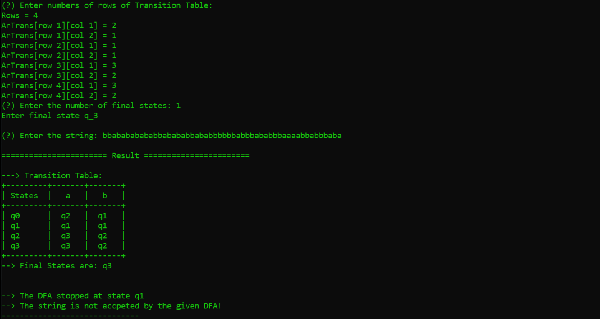
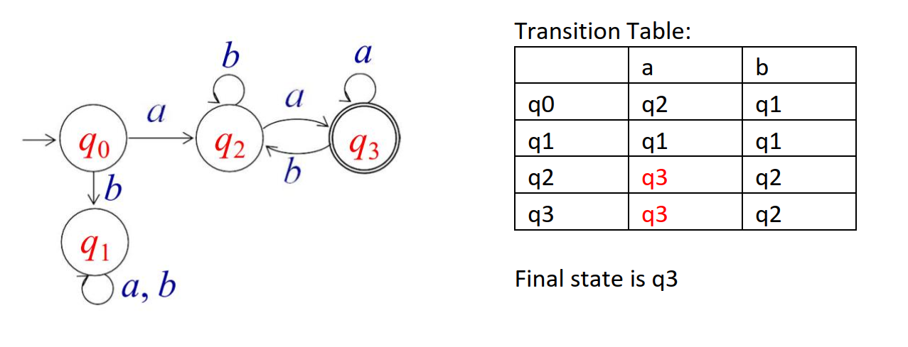
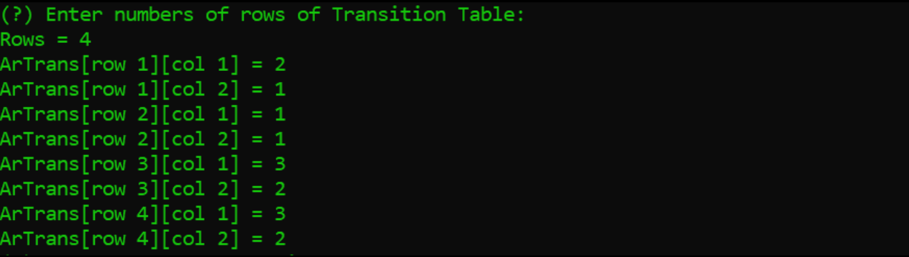
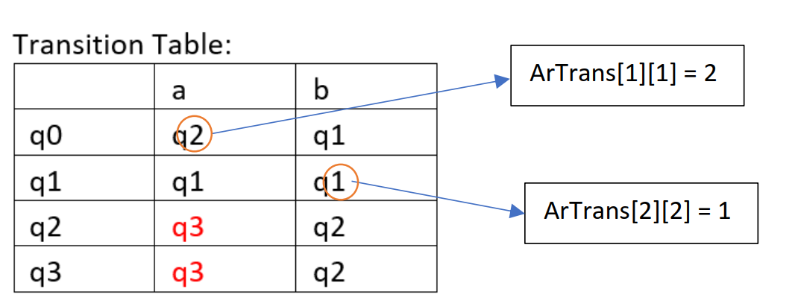
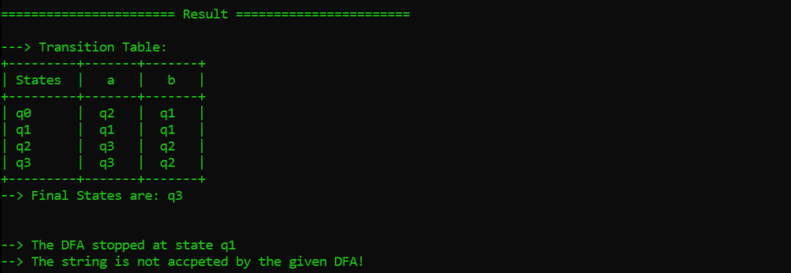
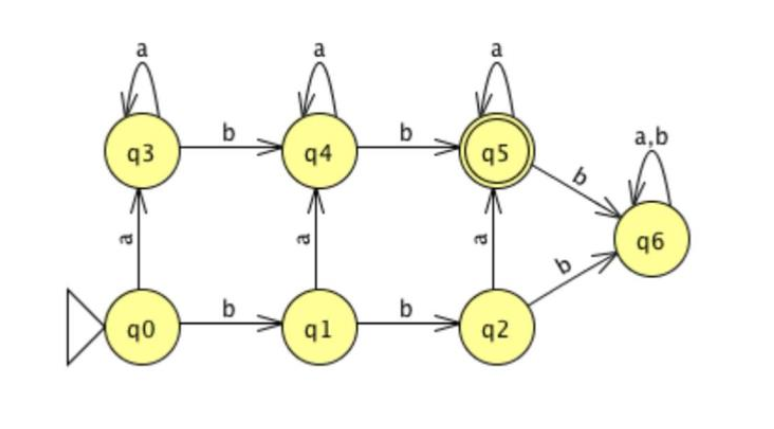
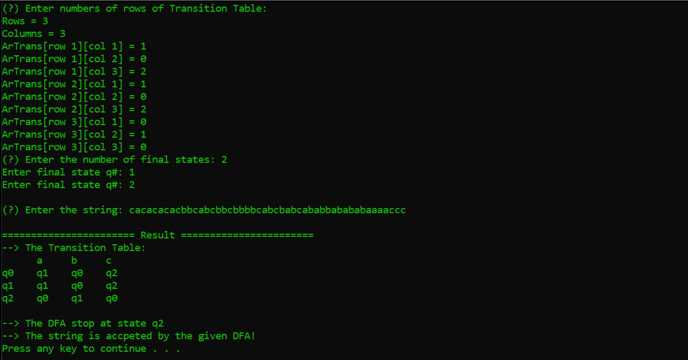

# DFA CHECKING TOOL DOCUMENTATION

## Theoretical Computer Science  
### Author: Vu Hoang Tuan Anh - 18812 



Read the documentation in pdf version: [here]([18812]%20DOCUMENTATION%20FOR%20USING%20MY%20DFA%20CHECK%20TOOL%20v2.pdf)

# Simple version (Has only 2 columns of the transition table)

Input requirement:

- The number of rows of the exact DFA transition table
- Every transition state of the transition table
- The number of final states, and the index of them
- The string which you want to check with the given DFA

Output:

- The visualization of the DFA transition table
- All the final states
- Which states that the DFA stopped when completing checking the string
- The validity of the string

**Demo:**

```
Given L(M) = {awa: w {a,b}*}, check the validity of the string bbabababababbaababbababbbbaa
```


```
Transition Table:
a b
q0 q2 q
q1 q1 q
q2 q3 q
q3 q3 q
```
```
The final state is q
```

Implement this problem in the program:

1. First we input the number of rows of the transition is 4, then enter each element of the table into the program like this:




2. Then we enter the number of final states and what they are:

```
(?) Enter the number of final states: 1
Enter final state q_3
```

3. After all, enter the string:
```
(?) Enter the string: bbabababababbaababbababbbbaa
```

4. Enjoy the final result:



Input sample I used above (Just copy it and paste on the program, then press Enter to see the result):

```
4 2 1 1 1 3 2 3 2 1 3
bbabababababbaababbababbbbaa
```

**Bonus Sample 2:**

```
Given L(M) = {anb^2 : n ≥ 1} (all strings with at least one a and exactly two b’s). Check the validity
of the string aaaaaaaaaaaabaaabaaaaaaaaaaaaa
```



**Input sample:**

```
7 3 1 4 2 5 6 3 4 4 5 5 6 6 6 1 5
aaaaaaaaaaaabaaabaaaaaaaaaaaaa
```

 

# Extended version (able to input the number of columns of the transition table)

Input requirement:

- The number of rows of the exact DFA transition table
- The number of columns of the exact DFA transition table
- Every transition state of the transition table
- The number of final states, and the index of them
- The string which you want to check with the given DFA

Output:

- The visualization of the DFA transition table
- ~~All the final states ( _are disabled_ ) (uncomment on the source code to enable this feature)~~
- Which states that the DFA stopped at when completing checking the string
- The validity of the string

**Demo:**


